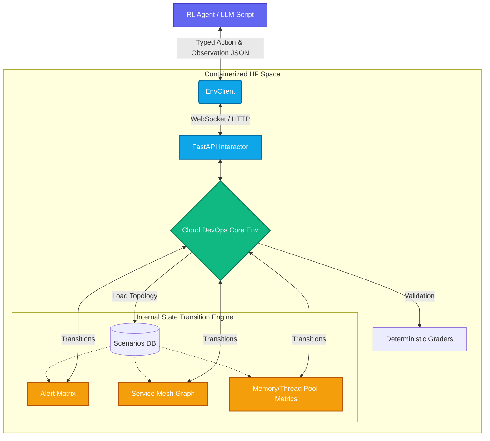

<div align="center">

# 🌩️ CloudDevOps-Env
### Production-Grade Site Reliability Engineering Simulator for RL Agents

**An Official Submission for the Meta PyTorch OpenEnv Hackathon 2026**

[](https://github.com/meta-pytorch/OpenEnv)
[](https://python.org)
[](https://fastapi.tiangolo.com)
[](https://docker.com)
[](https://huggingface.co/)
[](#license)

*Bridging the gap between toy grid-worlds and the $400B enterprise infrastructure landscape.*

</div>

---

## 🎯 Executive Summary & Strategic Value

**CloudDevOps-Env** pioneers real-world operational intelligence by dropping AI agents directly into the high-stakes environment of **Site Reliability Engineering (SRE)**. Traditional reinforcement learning environments evaluate agents on games or static tasks. In contrast, this environment simulates catastrophic distributed system failures, requiring agents to navigate noisy telemetry, parse fragmented log streams, execute terminal remediation protocols under strict time constraints, and prevent multi-million-dollar revenue drops.

By evaluating frontier models against production-grade IT incidents, we establish a novel baseline for **Autonomous Infrastructure Orchestration**. 

---

## 🧠 Architectural Topology

The environment is strictly bound to the **OpenEnv Core Specification**, utilizing a decoupled client-server architecture running over WebSockets bridged by FastAPI.



---

## 🔬 Subsystems & Interfaces

### 1. The Action Space: `CloudAction`
Agents interact with the distributed system topology via a strict schema of DevOps primitives. Blind iteration leads to catastrophic failure; targeted debugging triggers deterministic reward checkpoints.

| Subsystem Command | Target Argument | Operational Impact |
| :--- | :--- | :--- |
| 🔍 **Diagnostic Primitives** | | |
| `query_logs` | `<Service_ID>` | Aggregates STDERR/STDOUT streams, parsing heap dumps and network drops. |
| `check_metrics` | `<Service_ID>` | Exposes $P^{99}$ latency, connection pool exhaustion, and IOPS parameters. |
| `run_diagnostic` | `<Service_ID>` | Synthesizes an automated RCA (Root Cause Analysis). |
| ⚡ **Remediation Primitives** | | |
| `kill_process` | `<Process_ID>` | Force ungraceful termination (SIGKILL) of runaway threads (e.g., zombie sessions). |
| `apply_fix` | `<Target_ID>` | Implements patches (e.g., applying missing TTL configuration to Redis instances). |
| `rollback_migration` | `<Migration_ID>`| Reverses database schema degradation (requires synchronous locking of dependents). |
| 🔄 **Lifecycle Management** | | |
| `stop_service` | `<Service_ID>` | Graceful spin-down. Critical for preventing cascade data corruption during rollbacks. |
| `start_service` | `<Service_ID>` | Reboots services via orchestration engine. |
| `restart_service` | `<Service_ID>` | Bounces healthy/degraded nodes back to baseline. |
| 🛡️ **Validation** | | |
| `verify_health` | *Null* | Asserts all mesh endpoints are returning 200 OKs. Triggers final episode evaluation. |


### 2. The Observation Space: `CloudObservation`
A high-fidelity dimensional tensor (serialized as JSON for LLMs) mapping the live infrastructure state.

```json
{
  "step_number": 4,
  "task_progress": 0.45,
  "current_alerts": [
    "CRITICAL: Data integrity errors detected in orders table",
    "WARNING: Database migration 'v2.8.0' completed 30 minutes ago"
  ],
  "terminal_output": "=== METRICS: database ===\nConnections: 180/200\nDeadlocks: 12/min",
  "system_health": {
    "api-gateway": "degraded",
    "order-service": "critical",
    "database": "degraded"
  },
  "available_services": ["api-gateway", "order-service", "payment-service", "database"],
  "message": "[WARN] Retry storm observed on thread pool."
}
```

---

## ⚔️ The Escalation Matrix: Incident Scenarios

The framework enforces highly deterministic evaluation criteria via decoupled `Graders` measuring analytical efficiency, path optimization, and anti-loop protocols.

### 🟢 Tier I: Memory Exhaustion (Easy)
> **Incident ID:** `identify_service_failure`
* **Symptomology:** Upstream connection drops originating from the API Gateway resulting in widespread 500 status codes.
* **Corrupted Node:** `user-service`.
* **Pathology:** Unbounded Java Heap Space explosion (OOM kill via SIGKILL 137).
* **Validation Checkpoints:** ✅ Isolate Endpoint → ✅ Run Diagnostic Heap Trace → ✅ Execute Instance Daemon Restart.

### 🟡 Tier II: The Leak (Medium)
> **Incident ID:** `diagnose_memory_leak`
* **Symptomology:** Gradual 150MB/hour unbounded resident memory drift triggering auto-restart policies on critical revenue paths.
* **Corrupted Node:** `payment-service` & `cache-service`.
* **Pathology:** An application layer patch removed standard TTL (Time-To-Live) evictions on Redis persistence sessions, overloading standard node capacities.
* **Validation Checkpoints:** ✅ Correlate Metrics → ✅ Identify 120k Stale KV Pairs → ✅ Kill Zombie Process → ✅ Apply TTL Fix Protocols.

### 🔴 Tier III: Cascade Corruption (Hard)
> **Incident ID:** `database_rollback`
* **Symptomology:** P1 escalation: $15,000/minute revenue bleed via `DataIntegrityViolationException`.
* **Corrupted Node:** PostgreSQL Database cluster (`v2.8.0` schema).
* **Pathology:** Application bounds expect non-null matrices on legacy rows, violating structural constraints introduced during a live migration.
* **Validation Checkpoints:**
  ```mermaid
  stateDiagram-v2
      direction LR
      [*] --> Isolate_Bad_Migration
      Isolate_Bad_Migration --> Hard_Stop_Orders : MUST Halt Dependencies First
      Isolate_Bad_Migration --> Hard_Stop_Payments : MUST Halt Dependencies First
      Hard_Stop_Orders --> Execute_Data_Rollback
      Hard_Stop_Payments --> Execute_Data_Rollback
      Execute_Data_Rollback --> Spin_Up_Services
      Spin_Up_Services --> Verify_Green_Status
      Verify_Green_Status --> [*]
  ```
* *Note: Attempting a structural rollback while active read/write dependencies are spun up invokes immediate data truncation penalties (-0.1 reward) mirroring catastrophic failure.*

---

## 🚀 Deployment & Local Execution

This repository enforces strict deployment parameters and leverages robust toolchains (`uv`, `pytest`, `docker`).

### 1. Native Environment Spin-up
Ensure your system uses Python `3.10+`.

```bash
# Clone the repository
git clone https://github.com/dhruvtalnewar01/Meta-PyTorch-Hackathon-OpenEnv-by-Dhruv.git
cd Meta-PyTorch-Hackathon-OpenEnv-by-Dhruv

# Lock and build exact dependencies natively
uv lock
pip install -e .

# Initiate Uvicorn FastAPI WebSocket Server
cd cloud_devops_env/server
uvicorn app:app --host 0.0.0.0 --port 7860
```

### 2. Multi-Mode Docker Deployment (HuggingFace Spec)
The `Dockerfile` is precisely calibrated to bind on standard ports over user `1000`.
```bash
docker build -t cloud-devops-env .
docker run -p 7860:7860 cloud-devops-env
```

### 3. Agent Inference Evaluation
Once the server is spun up, trigger the deterministic SRE LangChain evaluation. This strictly enforces the standard `[START]`, `[STEP]`, `[END]` protocol bounds.

```bash
# In an isolated terminal session
export API_BASE_URL="https://api.openai.com/v1"  # Or your chosen API route
export MODEL_NAME="gpt-4o-mini"
export HF_TOKEN="your-access-token"

python inference.py
```

---

## 📊 Evaluation & Grader Calibration

The Grader architecture intercepts environment topologies sequentially, mapping state arrays and outputting a continuous normalized score bounded securely between `[0.0, 1.0]`. 

**Baseline Observations (Standard deviation ~0.08):**
| Difficulty Frontier | Baseline Average Output | Steps to Resolution |
|---------------------|--------------------------|----------------------|
| **Easy** | `0.92 / 1.00` | `~4 steps` |
| **Medium** | `0.78 / 1.00` | `~9 steps` |
| **Hard** | `0.52 / 1.00` | `~15 steps` |

**Reward Penalty Calculus:**
* `-0.05` applied iteratively upon repetitive failure boundaries (anti-loop measures).
* `-0.05` for unnecessary cascading shutdowns unattached to the isolated anomaly line.
* Immediate Episode Termination triggered upon infinite failure recursion thresholds.

---

<div align="center">
  <b>Built for the Future of Automation</b><br>
  Meta PyTorch OpenEnv Hackathon 2026<br><br>
  
  <i>Dhruv Talnewar</i>
</div>
